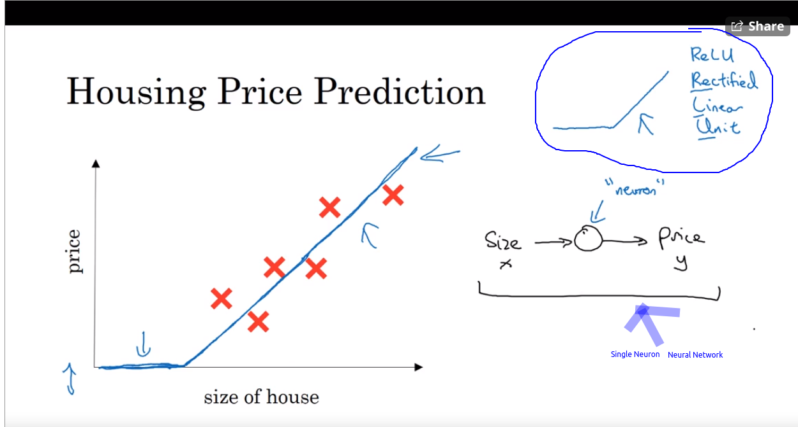
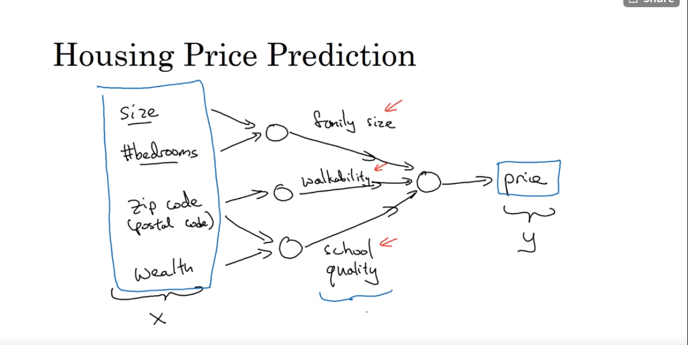
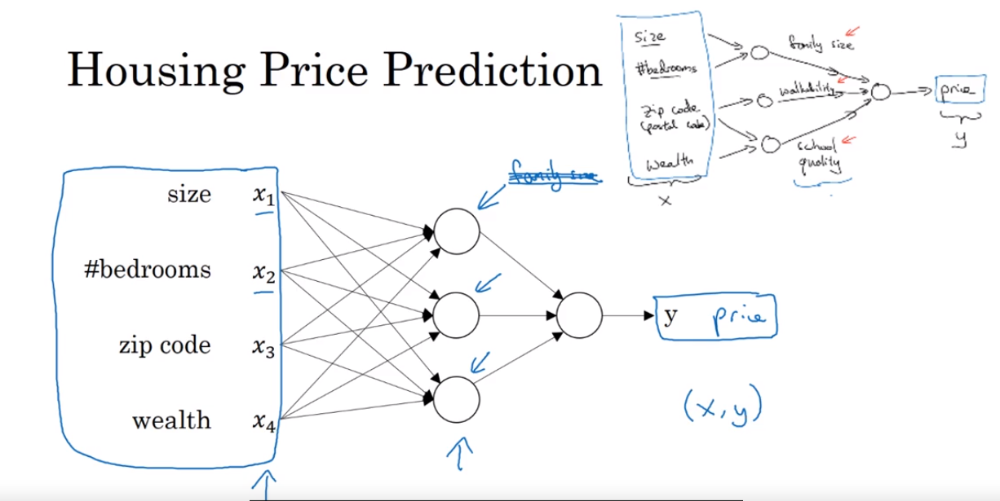
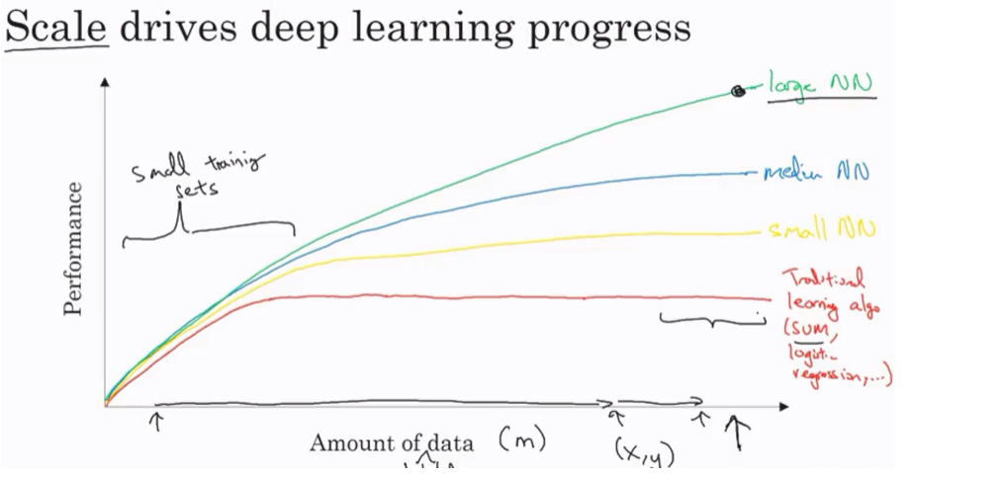

Week 1

# Week 1

## What is NN?

1.  That function (pointed by arrow) is a single Neuron Neural Network, more complex ones have several neurons/nodes stacked together.
2.  The graph/function is a ReLU, blue line denoting the equation to predict price of house.

A larger NN formed by stacking more of the functions/nodes. Each of these is a ReLU.
Its basically a mapping from x (input) to y (output).

Here every input feature is connected to every node of inner layer, hence they are densely connected.

## Supervised learning with neural networks

Different types of neural networks for supervised learning which includes:

- CNN or convolutional neural networks (Useful in computer vision)
    
- RNN or Recurrent neural networks (Useful in Speech recognition or NLP as data is a sequence)
    
- Standard NN (Useful for Structured data)
    
- Hybrid/custom NN or a Collection of NNs types (eg self-driving car)
    
- Structured data is like the databases and tables.
    
- Unstructured data is like images, video, audio, and text.
    
- Structured data gives more money because companies relies on prediction on its big data.
    
- slightly more difficult to perform deep learning on unstructured data.
    

## Why is deep learning taking off?

- Deep learning is taking off for 3 reasons:
    
    1.  Data:
        - Using this image we can conclude:
            
            `Note: amount of data is denoted by 'm'.`
        - For small data NN can perform as well as Linear regression or SVM (Support vector machine)
        - For big data a small NN is better that SVM
        - For big data a big NN is better than small NN.
        - We will have a lot of data because the world is using the computers and softwares increasingly, hence deep learning will grow.
            - Mobiles
            - IOT (Internet of things)
    2.  Computation:
        - GPUs.
        - Powerful CPUs.
        - Distributed computing.
        - ASICs
    3.  Algorithm:
        1.  Creative algorithms has appeared that changed the way NN works.
            - For example using RELU function is so much better than using SIGMOID function in training a NN because it helps with the vanishing gradient problem. (for greater x, gradient becomes almost 0 hence learning very slow)