Week 3

## Shallow neural networks

> Learn to build a neural network with one hidden layer, using forward propagation and backpropagation.

### Neural Networks Overview

- In logistic regression we had:
    
    ```
    X1  \  
    X2   ==>  z = XW + B ==> a = Sigmoid(z) ==> l(a,Y)
    X3  / 
    ```
    
- In neural networks with one layer we will have:
    
    ```
    X1  \  
    X2   =>  z1 = XW1 + B1 => a1 = Sigmoid(z1) => z2 = a1W2 + B2 => a2 = Sigmoid(z2) => l(a2,Y)
    X3  / 
    ```
    
- `X` is the input vector `(X1, X2, X3)`, and `Y` is the output variable `(1x1)`
    
- NN is stack of logistic regression objects.
    

### Neural Network Representation

- 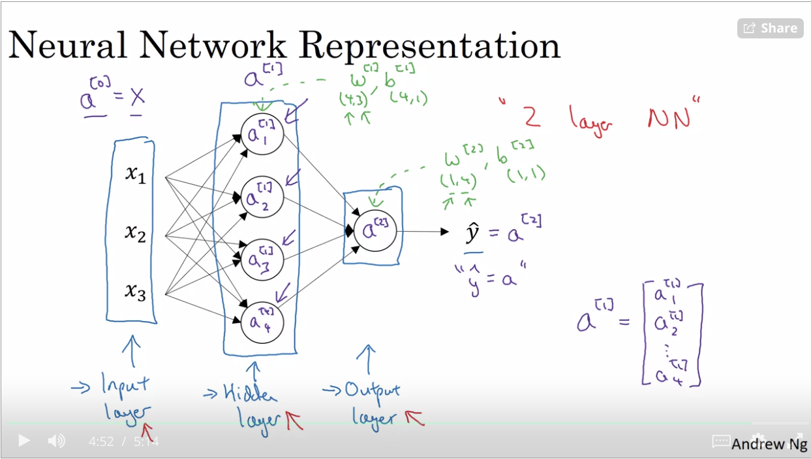
- Hidden layer means we cant see that layers in the training set.
- a<sup>\[0\]</sup> = x (the input layer)
- a<sup>\[1\]</sup> will represent the activation of the hidden neurons.
- a<sup>\[2\]</sup> will represent the output layer.
- THis is a 2 layered NN. The input layer isn't counted.

### Computing a Neural Network's Output

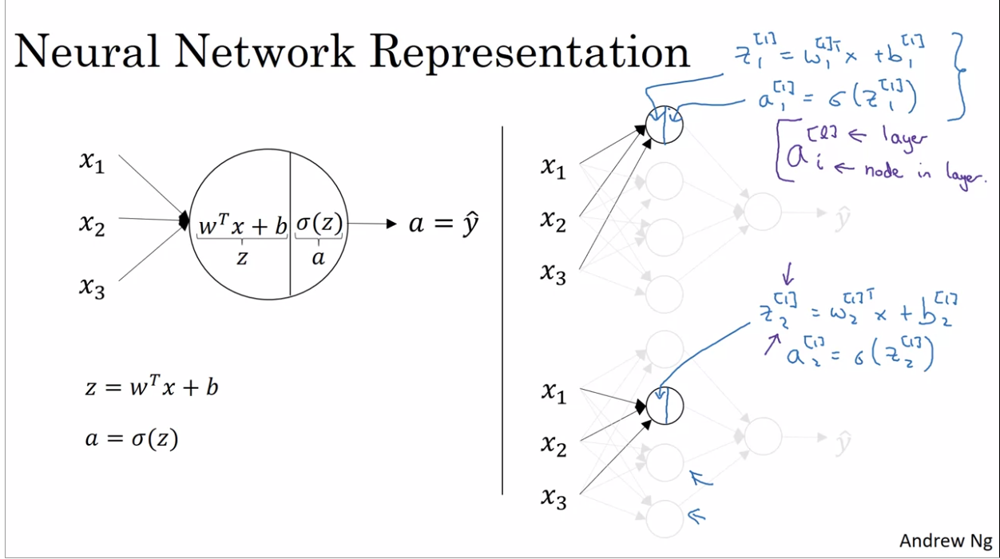

- Equations of Hidden layers:[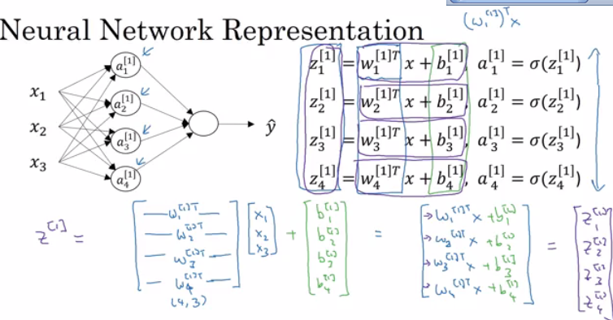](https://github.com/mbadry1/DeepLearning.ai-Summary/blob/master/1-%20Neural%20Networks%20and%20Deep%20Learning/Images/05.png)
    
- Here are some informations about the last image:
    
    - `noOfHiddenNeurons = 4`
    - `Nx (noOfFeatures) = 3`
    - Shapes of the variables:
        - `W1` is the matrix of the first hidden layer, it has a shape of `(noOfHiddenNeurons,nx)`
        - `b1` is the matrix of the first hidden layer, it has a shape of `(noOfHiddenNeurons,1)`
        - `z1` is the result of the equation `z1 = W1*X + b`, it has a shape of `(noOfHiddenNeurons,1)`
        - `a1` is the result of the equation `a1 = sigmoid(z1)`, it has a shape of `(noOfHiddenNeurons,1)`
        - `W2` is the matrix of the second hidden layer, it has a shape of `(1,noOfHiddenNeurons)`
        - `b2` is the matrix of the second hidden layer, it has a shape of `(1,1)`
        - `z2` is the result of the equation `z2 = W2*a1 + b`, it has a shape of `(1,1)`
        - `a2` is the result of the equation `a2 = sigmoid(z2)`, it has a shape of `(1,1)`
- 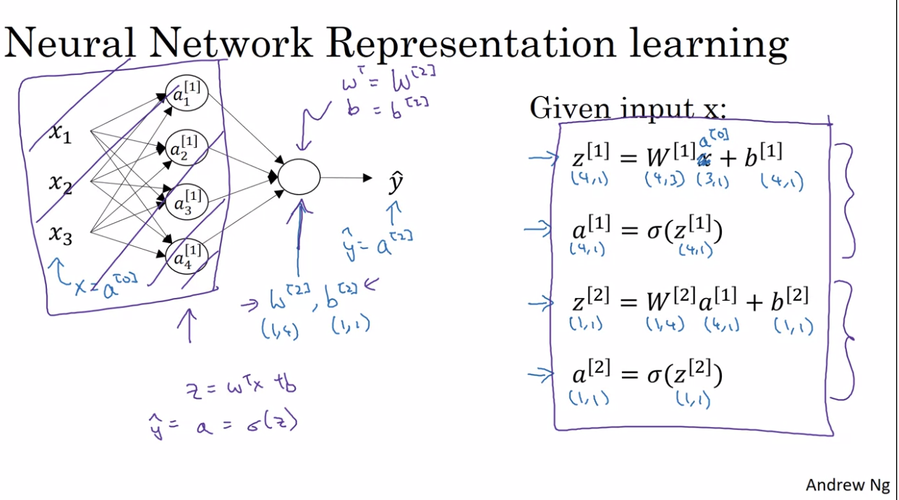

### Vectorizing across multiple examples

### 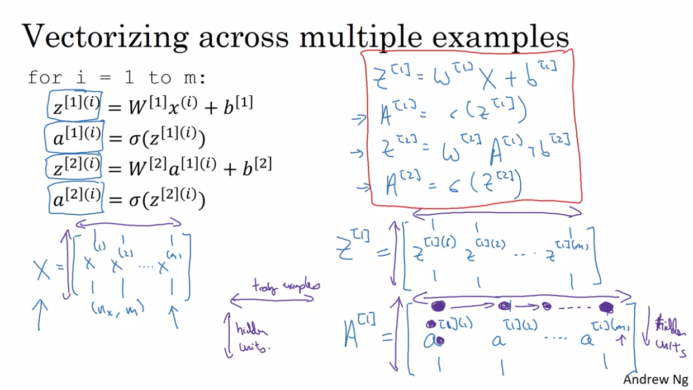

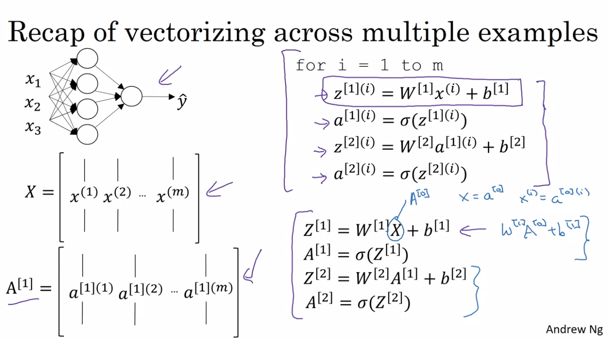

### Activation functions

- So far we are using sigmoid, but in some cases other functions can be a lot better.
    
- Sigmoid can lead us to gradient decent problem where the updates are so low.
    
- Sigmoid activation function range is \[0,1\] `A = 1 / (1 + np.exp(-z)) # Where z is the input matrix`
    
- Tanh activation function range is \[-1,1\] (Shifted version of sigmoid function)
    
    - In NumPy we can implement Tanh using one of these methods: `A = (np.exp(z) - np.exp(-z)) / (np.exp(z) + np.exp(-z)) # Where z is the input matrix`
        
        Or `A = np.tanh(z) # Where z is the input matrix`
        
- It turns out that the tanh activation usually works better than sigmoid activation function for hidden units because the mean of its output is closer to zero, and so it centers the data better for the next layer.
    
- We can use different functions for different layers, for eg:
    
- 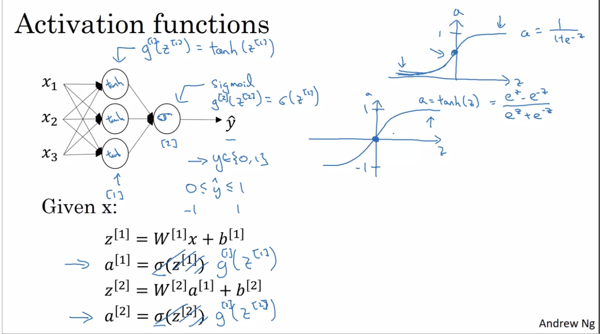
- Here g <sup>\[1\]</sup> is tanh and g<sup>\[2\]</sup> is sigmoid as it gives output yhat in \[0,1\] which is `better for binary classification.`
    
- In all other cases we prefer the ReLU func.
    
- Sigmoid or Tanh function disadvantage is that if the input is too small or too high, the slope will be near zero which will cause us the gradient decent problem.
    
- One of the popular activation functions that solved the slow gradient decent is the RELU function. `RELU = max(0,z) # so if z is negative the slope is 0 and if z is positive the slope remains linear.`
    
- Leaky RELU activation function different of RELU is that if the input is negative the slope will be so small. It works as RELU but most people uses RELU. `Leaky_RELU = max(0.01z,z) #the 0.01 can be a parameter for your algorithm.`
    

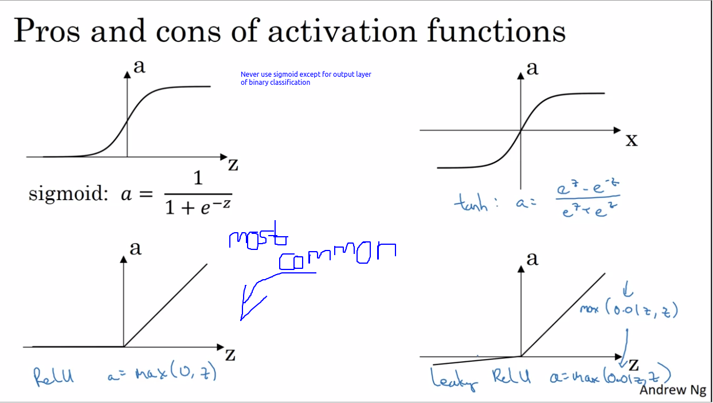

### Why do you need non-linear activation functions?

- If we removed the activation function from our algorithm that can be called linear activation function.
- Linear activation function will output linear activations
    - Whatever hidden layers you add, the activation will always be linear (So its useless in a lot of complex problems)
- You might use linear activation function in one place - in the output layer if the output is real numbers like predction house prices(regression problem). But even in this case if the output value is non-negative you could use RELU instead.
- 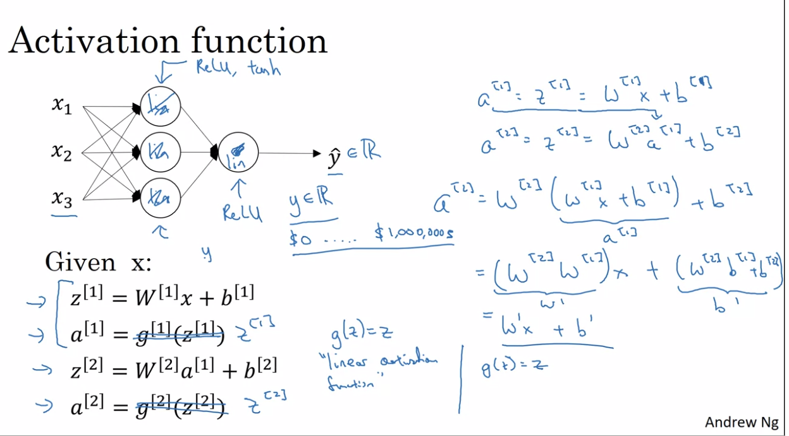

### Derivatives of activation functions

- Derivation of Sigmoid activation function:
    
    ```
    g(z)  = 1 / (1 + np.exp(-z))
    g'(z) = (1 / (1 + np.exp(-z))) * (1 - (1 / (1 + np.exp(-z))))
    g'(z) = g(z) * (1 - g(z)) 
    ```
    
- Derivation of Tanh activation function:
    
    ```
    g(z)  = (e^z - e^-z) / (e^z + e^-z)
    g'(z) = 1 - np.tanh(z)^2 = 1 - g(z)^2
    ```
    
    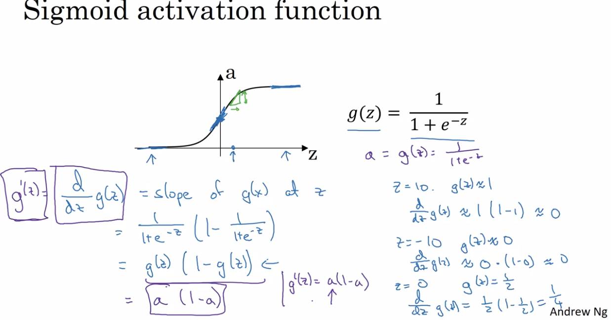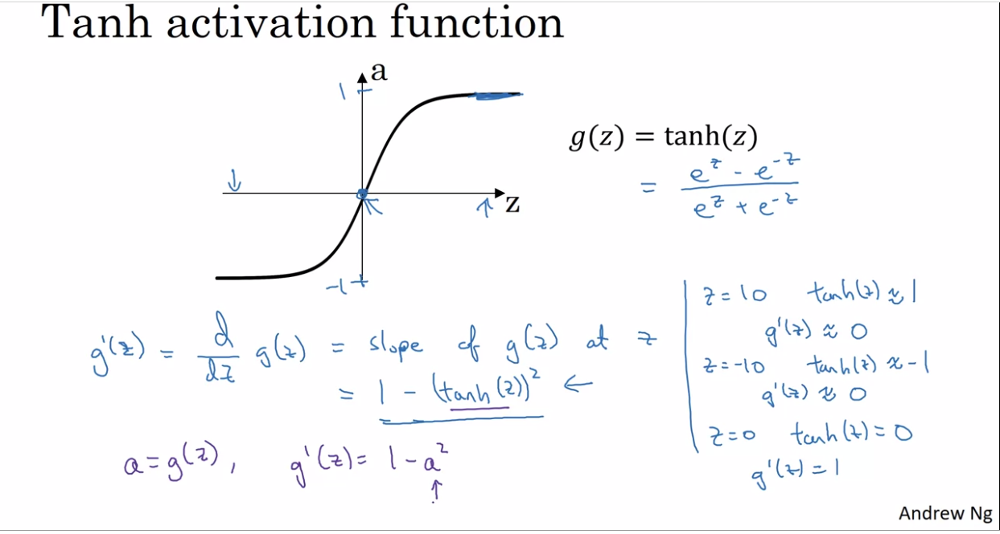
    
- Derivation of RELU activation function:
    
    ```
    g(z)  = np.maximum(0,z)
    g'(z) = { 0  if z < 0
              1  if z >= 0  } 
    ```
    
- Derivation of leaky RELU activation function:
    
    ```
    g(z)  = np.maximum(0.01 * z, z)
    g'(z) = { 0.01  if z < 0
              1     if z >= 0   } 
    ```
    

### Gradient descent for Neural Networks

- In this section we will have the full back propagation of the neural network (Just the equations with no explanations).
    
- Gradient descent algorithm:
    
    - NN parameters:
        
        - `n[0] = Nx`
        - `n[1] = NoOfHiddenNeurons`
        - `n[2] = NoOfOutputNeurons = 1`
        - `W1` shape is `(n[1],n[0])`
        - `b1` shape is `(n[1],1)`
        - `W2` shape is `(n[2],n[1])`
        - `b2` shape is `(n[2],1)`
    - Cost function `I = I(W1, b1, W2, b2) = (1/m) * Sum(L(Y,A2))`
        
    - Then Gradient descent:
        
        ```
        Repeat:
                Compute predictions (y'[i], i = 0,...m)
                Get derivatives: dW1, db1, dW2, db2
                Update: W1 = W1 - LearningRate * dW1
                        b1 = b1 - LearningRate * db1
                        W2 = W2 - LearningRate * dW2
                        b2 = b2 - LearningRate * db2 
        ```
        
- 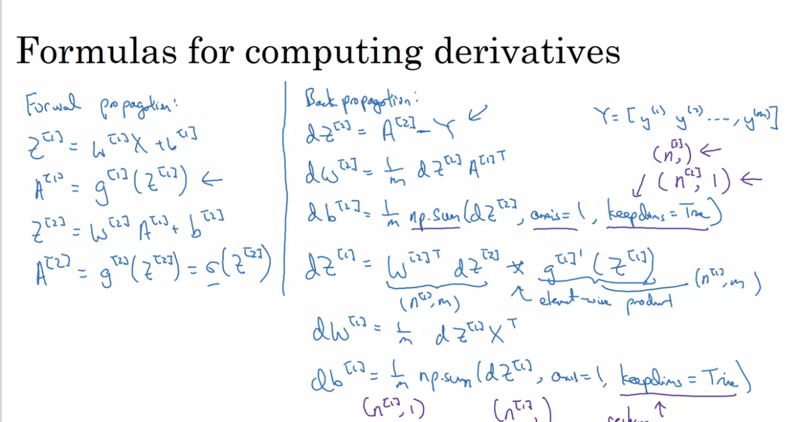
    

```
dZ2 = A2 - Y      
dW2 = (np.dot(dZ2,A1.T)) / m
db2 = np.sum(dZ2,axis=1,keepdims=True) / m
dZ1 = (W2.T * dZ2) * g1'(Z1)  # g1'(z1) or (1-A1^2)
dW1 = (np.dot(dZ1,A0.T)) / m   # A0 = X
db1 = np.sum(dZ1,axis=1,keepdims=True) / m
```

### Random Initialization

- In logistic regression it wasn't important to initialize the weights randomly, while in NN we have to initialize them randomly.
    
- If we initialize all the weights with zeros in NN it won't work (initializing bias with zero is OK):
    
    - all hidden units will be completely identical (symmetric) - compute exactly the same function
    - on each gradient descent iteration all the hidden units will always update the same
- To solve this we initialize the W's with a small random numbers:
    
    ```
    W1 = np.random.randn((2,2)) * 0.01    # 0.01 to make it small enough
    b1 = np.zeros((2,1))                  # its ok to have b as zero, it won't get us to the symmetry breaking problem 
    ```
    
- We need small values because in sigmoid (or tanh), for example, if the weight is too large you are more likely to end up even at the very start of training with very large values of Z. Which causes your tanh or your sigmoid activation function to be saturated, thus slowing down learning. If you don't have any sigmoid or tanh activation functions throughout your neural network, this is less of an issue.
    
- Constant 0.01 is alright for 1 hidden layer networks, but if the NN is deep this number can be changed but it will always be a small number.