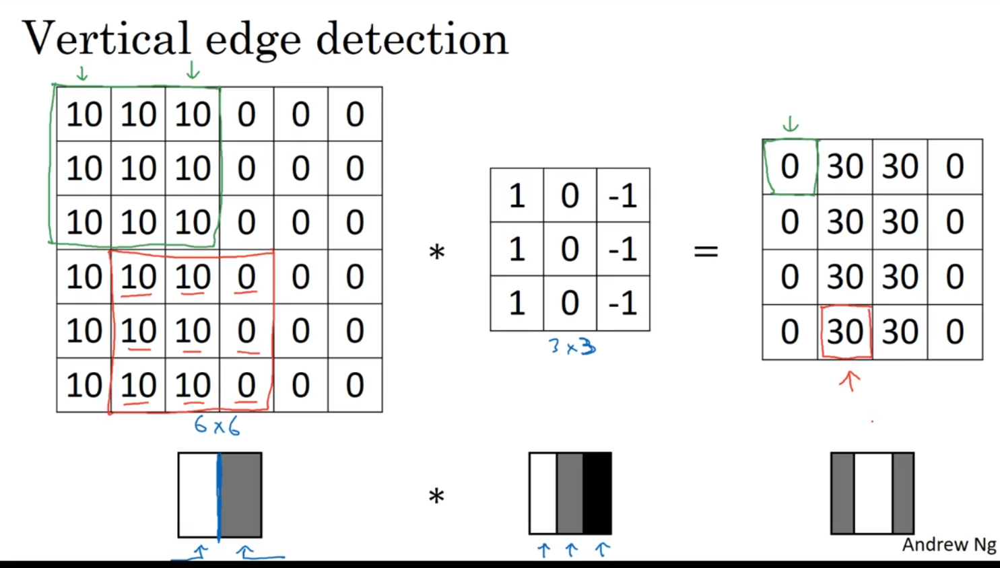

Week 1

## Foundations of CNNs

> Learn to implement the foundational layers of CNNs (pooling, convolutions) and to stack them properly in a deep network to solve multi-class image classification problems.

### Computer vision

- Computer vision is one of the applications that are rapidly active thanks to deep learning.
- Some of the applications of computer vision that are using deep learning includes:
    - Self driving cars.
    - Face recognition.
- Deep learning is also enabling new types of art to be created.
- Rapid changes to computer vision are making new applications that weren't possible a few years ago.
- Computer vision deep leaning techniques are always evolving making a new architectures which can help us in other areas other than computer vision.
    - For example, Andrew Ng took some ideas of computer vision and applied it in speech recognition.
- Examples of a computer vision problems includes:
    - Image classification.
    - Object detection.
        - Detect object and localize them.
    - Neural style transfer
        - Changes the style of an image using another image.
- One of the challenges of computer vision problem that images can be so large and we want a fast and accurate algorithm to work with that.
    - For example, a `1000x1000` image will represent 3 million feature/input to the full connected neural network. If the following hidden layer contains 1000, then we will want to learn weights of the shape `[1000, 3 million]` which is 3 billion parameter only in the first layer and thats so computationally expensive!
- One of the solutions is to build this using **convolution layers** instead of the **fully connected layers**.

### Edge detection example

- The convolution operation is one of the fundamentals blocks of a CNN. One of the examples about convolution is the image edge detection operation.
    
- Early layers of CNN might detect edges then the middle layers will detect parts of objects and the later layers will put the these parts together to produce an output.
    
- In an image we can detect vertical edges, horizontal edges, or full edge detector.
    
- Vertical edge detection:
    
    - An example of convolution operation to detect vertical edges:
        - 
    - If we applied this filter to a white region followed by a dark region, it should find the edges in between the two colors as a positive value. But if we applied the same filter to a dark region followed by a white region it will give us negative values. To solve this we can use the abs function to make it positive.

- Horizontal edge detection
    
    - Filter would be like this
        
        ```
        1	1	1
        0	0	0
        -1	-1	-1 
        ```
        
- There are a lot of ways we can put number inside the horizontal or vertical edge detections.
    
- For example here are the vertical **Sobel** filter (The idea is taking care of the middle row):
    
    ```
    1	0	-1
    2	0	-2
    1	0	-1 
    ```
    
- Also something called **Scharr** filter (The idea is taking great care of the middle row):
    
    ```
    3	0	-3
    10	0	-10
    3	0	-3 
    ```
    
- for horizontal we just rotate it by 90
- What we learned in the deep learning is that we don't need to hand craft these numbers, we can treat them as weights/parameters and then learn them. It can learn horizontal, vertical, angled, or any edge type automatically rather than getting them by hand.